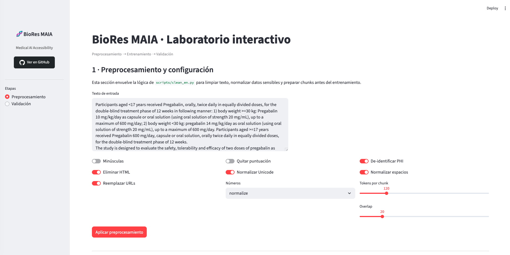
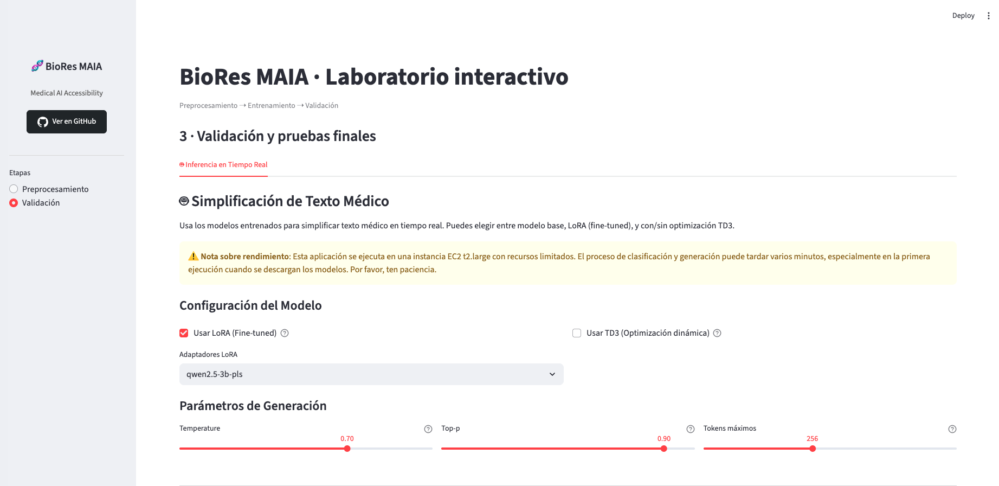

# BioRes MAIA

**Sistema BIORES: Generación Automática de Resúmenes en Lenguaje Simple para Documentos Biomédicos usando SLMs**

Pipeline completo de preprocesamiento, entrenamiento y validación para la clasificación y simplificación automática de textos médicos. El sistema permite transformar documentos biomédicos complejos (NO_PLS) a lenguaje simple y accesible (PLS - Plain Language Summary), facilitando la comprensión de información médica para el público general.

## 👥 Integrantes

**Maestría en Inteligencia Artificial**  
Universidad de los Andes, Bogotá D.C.

- **Daniel S. Moreno-Sandoval** - [ds.morenos1@uniandes.edu.co](mailto:ds.morenos1@uniandes.edu.co)
- **William A. Moreno-Agudelo** - [w.morenoa@uniandes.edu.co](mailto:w.morenoa@uniandes.edu.co)
- **Gustavo Contreras-Herrera** - [g.contreras118@uniandes.edu.co](mailto:g.contreras118@uniandes.edu.co)
- **Yernel A. Cardona-Chao** - [ma.cardona@uniandes.edu.co](mailto:ma.cardona@uniandes.edu.co)

## 🎯 Objetivo del Proyecto

El proyecto BioRes MAIA aborda el problema de la brecha de alfabetización en salud mediante el desarrollo de un sistema automatizado que:

1. **Clasifica** documentos biomédicos según su nivel de complejidad (PLS vs NO_PLS)
2. **Simplifica** textos médicos complejos a lenguaje llano y accesible
3. **Evalúa** la calidad y legibilidad de las simplificaciones generadas
4. **Despliega** una interfaz web interactiva para uso práctico

El sistema utiliza Small Language Models (SLMs) fine-tuneados con técnicas de Parameter-Efficient Fine-Tuning (PEFT) como LoRA, optimizando el balance entre rendimiento y recursos computacionales.

## 📋 Requisitos

- Python 3.10+
- Docker & Docker Compose (para despliegue con contenedores)
- UV (opcional, para instalación rápida de dependencias)

### Dependencias principales


El proyecto utiliza las siguientes dependencias clave organizadas por categoría:

#### Procesamiento de texto y NLP
- **spacy** (≥3.5.0): Procesamiento de lenguaje natural y tokenización
- **beautifulsoup4** (≥4.12.0): Parsing y limpieza de HTML
- **unidecode** (≥1.3.6): Normalización de caracteres Unicode
- **ftfy** (≥6.1.1): Corrección automática de texto corrupto
- **regex** (≥2023.8.8): Expresiones regulares avanzadas
- **textstat** (≥0.7.11): Métricas de legibilidad de texto

#### Machine Learning y Deep Learning
- **scikit-learn** (≥1.5.0): Algoritmos de clasificación y métricas
- **peft** (≥0.18.0): Parameter-Efficient Fine-Tuning para LLMs
- **stable-baselines3** (==2.3.0): Algoritmos de reinforcement learning
- **gymnasium** (==0.29.1): API estándar para entornos de RL

#### Manipulación de datos
- **pandas** (≥1.5.0): Análisis y manipulación de datos tabulares
- **pyarrow** (≥11.0.0): Formato columnar eficiente para datasets grandes

#### Visualización
- **matplotlib** (≥3.10.7): Gráficos y visualizaciones estáticas
- **plotly** (≥5.24.0): Visualizaciones interactivas
- **altair** (≥5.3.0): Gramática declarativa de visualización
- **streamlit** (≥1.39.0): Framework para aplicaciones web de ML/AI

#### API y servicios web
- **fastapi** (≥0.104.0): Framework web asíncrono de alto rendimiento
- **uvicorn[standard]** (≥0.24.0): Servidor ASGI para FastAPI
- **pydantic** (≥2.5.0): Validación de datos con type hints
- **python-multipart** (≥0.0.6): Parsing de formularios multipart

#### Almacenamiento y I/O
- **fsspec** (≥2023.11.0): Sistema de archivos unificado (S3, local, etc.)
- **smart-open** (≥6.3.0): Lectura/escritura transparente en S3, HTTP, etc.
- **pyyaml** (≥6.0.3): Parsing de archivos de configuración YAML

#### Utilidades
- **tqdm** (≥4.65.0): Barras de progreso para iteraciones
- **joblib** (≥1.5.2): Paralelización y caching de funciones
- **tqdm-joblib** (≥0.0.5): Integración de tqdm con joblib
- **watchdog** (≥6.0.0): Monitoreo de cambios en archivos
- **filelock** (≥3.20.0): Bloqueo de archivos multiplataforma
- **lxml** (≥6.0.2): Parsing rápido de XML/HTML

## 🚀 Instalación

### Opción 1: Instalación local con UV (recomendado)

```bash
# Instalar UV si no lo tienes
curl -LsSf https://astral.sh/uv/install.sh | sh

# Clonar el repositorio
git clone https://github.com/06danielsms/biores_maia.git
cd biores_maia

# Instalar el proyecto y todas sus dependencias
uv pip install -e .
```

### Opción 2: Instalación local con pip

```bash
# Clonar el repositorio
git clone https://github.com/06danielsms/biores_maia.git
cd biores_maia

# Crear entorno virtual
python -m venv venv
source venv/bin/activate  # En Windows: venv\Scripts\activate

# Instalar el proyecto
pip install -e .
```

## 🐳 Despliegue con Docker

### Construcción y ejecución

```bash
# Construir y levantar el servicio Streamlit
docker-compose up --build

# O en modo detached (segundo plano)
docker-compose up -d --build
```

### Acceso a la aplicación

**Despliegue local:**
Una vez levantado, abre tu navegador en: **http://localhost:8501**

**Despliegue en producción (AWS):**
La aplicación está desplegada en AWS EC2 y disponible en: **http://ec2-54-163-93-65.compute-1.amazonaws.com/**

#### Características de la instancia EC2

- **Tipo de instancia**: t2.large
- **vCPUs**: 2
- **Memoria RAM**: 8 GiB
- **Región**: us-east-1 (N. Virginia)
- **Sistema operativo**: Amazon Linux 2 / Ubuntu Server
- **Almacenamiento**: EBS optimizado
- **Red**: VPC con configuración de seguridad para tráfico HTTP (puerto 80)

### Comandos útiles

```bash
# Ver logs en tiempo real
docker-compose logs -f

# Detener el servicio
docker-compose down

# Reconstruir la imagen (después de cambiar dependencias)
docker-compose up --build --force-recreate

# Ver estado del contenedor
docker-compose ps
```

## 📊 Ejemplos de uso

### Aplicación Web Interactiva

La aplicación Streamlit de BioRes MAIA proporciona una interfaz visual completa para trabajar con el pipeline de simplificación de textos médicos. Incluye dos módulos principales:

#### 1. Módulo de Preprocesamiento y Configuración

Este módulo permite limpiar y preparar textos médicos antes del análisis o entrenamiento.

**Características principales:**

- **Limpieza de texto configurable:**
  - Eliminación de HTML y etiquetas
  - Normalización de Unicode y espacios en blanco
  - Reemplazo de URLs y correos electrónicos
  - De-identificación de PHI (Protected Health Information)
  - Normalización de números (keep/normalize/mask)
  - Control de puntuación y mayúsculas/minúsculas

- **Chunking inteligente:**
  - Configuración de tokens por chunk (50-400 tokens)
  - Control de overlap entre chunks (0-120 tokens)
  - Vista previa de chunks generados

- **Análisis de métricas:**
  - Visualización de diferencias entre texto original y procesado
  - Métricas de reducción de tokens y longitud
  - Estadísticas de vocabulario y longitud promedio de palabras
  - Histogramas, boxplots y correlaciones entre métricas
  - Comparación automática entre documentos PLS y NO_PLS

**Ejemplo de uso:**

```python
# Acceder al módulo de Preprocesamiento
1. Navega a la pestaña "Preprocesamiento" en la barra lateral
2. Ingresa o carga un texto médico en el área de texto
3. Configura las opciones de limpieza:
   - Activa "Eliminar HTML" para limpiar etiquetas
   - Activa "De-identificar PHI" para anonimizar información sensible
   - Selecciona "normalize" para normalizar números
   - Ajusta "Tokens por chunk" a 120 y "Overlap" a 20
4. Haz clic en "Aplicar preprocesamiento"
5. Revisa el texto procesado y las métricas de reducción
6. Descarga el resultado o visualiza los chunks generados
```

**Análisis de métricas de preprocesamiento:**

El módulo incluye herramientas avanzadas para analizar las características textuales:

- **Métricas de legibilidad:** Flesch Reading Ease, ARI, Coleman-Liau
- **Diversidad léxica:** Type-Token Ratio (TTR), Hapax Legomena
- **Estadísticas estructurales:** Longitud de palabras/oraciones, densidad de stopwords
- **Visualizaciones interactivas:** Histogramas de densidad, boxplots comparativos, matrices de correlación

#### 2. Módulo de Validación e Inferencia

Este módulo permite validar modelos y generar simplificaciones en tiempo real usando modelos fine-tuneados.


**Características principales:**

- **Clasificación automática de textos:**
  - Usa un clasificador BERT fine-tuneado para determinar si un texto es PLS o NO_PLS
  - Evita procesamiento innecesario de textos que ya están simplificados
  - Proporciona feedback sobre el nivel de complejidad del texto

- **Inferencia con múltiples configuraciones:**
  - **Modelo base:** Qwen 2.5 3B Instruct sin fine-tuning
  - **LoRA (Fine-tuned):** Adaptadores LoRA entrenados específicamente para simplificación médica
  - **TD3 (Optimización dinámica):** Agente de reinforcement learning que ajusta automáticamente temperatura y top_p

- **Parámetros de generación configurables:**
  - **Temperature** (0.1-1.0): Controla la creatividad vs determinismo
  - **Top-p** (0.1-1.0): Nucleus sampling para diversidad controlada
  - **Max tokens** (64-512): Longitud máxima del resumen generado

- **Evaluación de legibilidad:**
  - Cálculo automático del Flesch Reading Ease Score
  - Interpretación del nivel de dificultad (muy fácil a muy difícil)
  - Comparación lado a lado del texto original vs simplificado

**Ejemplo de uso:**

```python
# Acceder al módulo de Validación
1. Navega a la pestaña "Validación" en la barra lateral
2. Selecciona la configuración del modelo:
   - Activa "Usar LoRA (Fine-tuned)" para mejor calidad
   - Opcionalmente activa "Usar TD3" para optimización automática
3. Si no usas TD3, configura manualmente:
   - Temperature: 0.7 (balance creatividad/precisión)
   - Top-p: 0.9 (diversidad del vocabulario)
   - Max tokens: 256 (longitud del resumen)
4. Ingresa el texto médico complejo en el área de entrada
5. Haz clic en "🚀 Generar Resumen Simplificado"
6. Espera mientras:
   - El clasificador BERT determina si el texto es PLS o NO_PLS
   - Si es NO_PLS, el modelo genera la simplificación
   - Si es PLS, se omite la generación (ya está simplificado)
7. Revisa el resultado:
   - Compara texto original vs simplificado
   - Analiza el Flesch Reading Ease Score
   - Revisa los tiempos de clasificación y generación
8. Descarga el resumen simplificado si lo necesitas
```

**Consideraciones de rendimiento:**

⚠️ La aplicación se ejecuta en una instancia EC2 t2.large con recursos limitados:
- **Primera ejecución:** Puede tardar varios minutos al descargar modelos
- **Clasificación:** ~10-30 segundos con BERT
- **Generación:** ~1-5 minutos dependiendo del texto y configuración
- **Memoria:** El modelo puede liberarse manualmente con el botón "🗑️ Liberar Memoria"

**Interpretación de resultados:**

El Flesch Reading Ease Score indica:
- **> 80:** Muy fácil de leer (nivel primaria)
- **60-80:** Estándar - Fácil (nivel secundaria)
- **50-60:** Moderadamente difícil (nivel universitario)
- **30-50:** Difícil (nivel académico)
- **< 30:** Muy difícil (nivel especializado)

Los resúmenes generados por BioRes MAIA típicamente alcanzan scores de 60-80, haciéndolos accesibles para el público general sin sacrificar precisión médica.

### Notebooks

Explora los notebooks en `jupyter/` para análisis más detallados:

- `Clasificador.ipynb`: Pipeline completo de clasificación PLS/NO_PLS
- `Qwen2_5_3B.ipynb`: Fine-tuning y evaluación con Qwen 2.5 3B

## 📁 Estructura del Proyecto

```
biores_maia/
├── streamlit/                      # Aplicación web Streamlit
│   ├── app.py                      # Punto de entrada principal
│   ├── preprocessing.py            # Módulo de preprocesamiento
│   ├── validation.py               # Módulo de validación e inferencia
│   ├── inference.py                # Lógica de inferencia con modelos
│   ├── training.py                 # Módulo de entrenamiento
│   ├── metrics_computer.py         # Cálculo de métricas textuales
│   ├── metrics_visualizer.py       # Visualización de métricas
│   ├── clean_en_local.py           # Utilidades de limpieza de texto
│   ├── utils.py                    # Funciones auxiliares
│   └── requirements.txt            # Dependencias específicas
│
├── scripts/                        # Scripts de preprocesamiento y análisis
│   ├── clean_en.py                 # Pipeline de limpieza de texto
│   ├── compute_metrics.py          # Cálculo de métricas de legibilidad
│   ├── plot_distributions.py       # Visualización de distribuciones
│   └── data_raw/                   # Datos sin procesar (PLS/NO_PLS)
│
├── inference/                      # Modelos y recursos para inferencia
│   ├── qwen2.5-3b-pls/            # Adaptadores LoRA fine-tuneados
│   │   ├── adapter_config.json
│   │   └── adapter_model.safetensors
│   ├── clasificador_medico_sencillo.pkl  # Clasificador BERT
│   ├── td3_base_agent.zip         # Agente TD3 para modelo base
│   ├── td3_lora_agent.zip         # Agente TD3 para modelo LoRA
│   ├── examples.txt                # Ejemplos de texto médico
│   ├── test_inference.py           # Tests de inferencia
│   └── run_examples.sh             # Script para ejecutar ejemplos
│
├── notebooks/                      # Notebooks de análisis y entrenamiento
│   ├── Clasificador.ipynb          # Pipeline de clasificación PLS/NO_PLS
│   ├── Qwen2_5_3B.ipynb           # Fine-tuning con Qwen 2.5 3B
│   └── POC/                        # Pruebas de concepto
│
├── config/                         # Archivos de configuración
│   └── config.yaml                 # Configuración principal del proyecto
│
├── datos/                          # Datasets del proyecto
│   ├── PLS/                        # Textos en lenguaje simple
│   └── NO_PLS/                     # Textos médicos complejos
│
├── metrics/                        # Resultados de métricas (generados)
│   └── *.parquet                   # Métricas computadas por chunk
│
├── modelos/                        # Modelos entrenados
│   ├── Clasificador/               # Clasificador de textos médicos
│   │   └── clasificador_medico_sencillo.pkl
│   └── qwen2.5-3b-pls/            # Adaptadores LoRA para Qwen 2.5 3B
│       ├── adapter_config.json
│       ├── adapter_model.safetensors
│       └── README.md
│
├── mockups/                        # Mockups y prototipos de UI
│   ├── data_preprocessing_configuration/
│   ├── model_training_&_monitoring/
│   └── model_validation_&_testing/
│
├── assets/                         # Recursos multimedia
│   ├── preprocess.png              # Captura módulo preprocesamiento
│   └── inference.png               # Captura módulo inferencia
│
├── pyproject.toml                  # Configuración de proyecto y dependencias
├── uv.lock                         # Lock file de UV para reproducibilidad
├── Dockerfile                      # Imagen Docker para la aplicación
├── docker-compose.yml              # Orquestación de servicios Docker
├── architecture.md                 # Documentación de arquitectura
└── README.md                       # Este archivo
```


## 🔧 Configuración

Edita `config/config.yaml` para ajustar parametros de scripts:

- Rutas de datos de entrada/salida
- Parámetros de preprocesamiento
- Configuración de métricas y visualizaciones

## 🛠️ Desarrollo

### Instalación de dependencias adicionales

```bash
# Con UV
uv pip install <paquete>

# Con pip
pip install <paquete>
```

### Hot-reload en Docker

El `docker-compose.yml` monta el directorio `streamlit/` como volumen, permitiendo hot-reload durante el desarrollo. Los cambios en el código se reflejan automáticamente sin necesidad de reconstruir la imagen.


