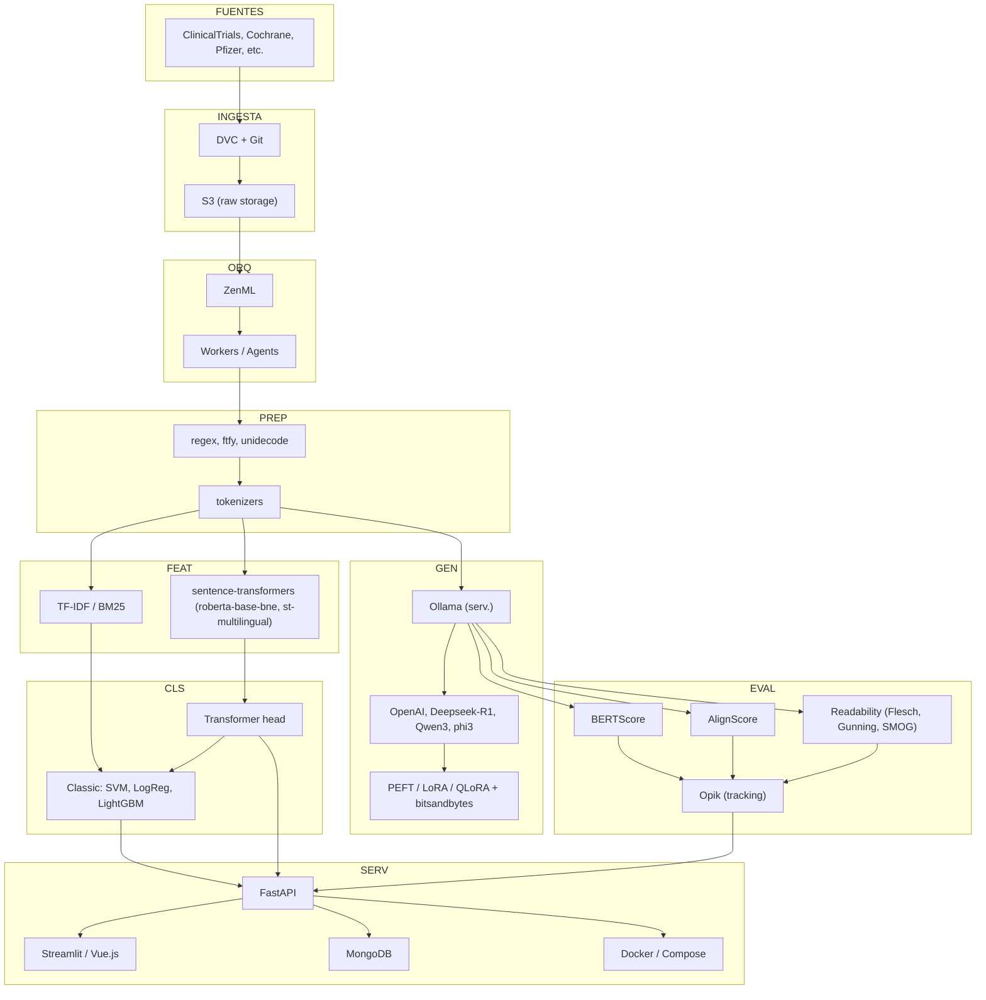

## Tecnologías por capa

- Fuentes: orígenes txt/CSV (ClinicalTrials, Cochrane, Pfizer, resúmenes).
- Ingesta y versionado: DVC + Git; almacenamiento bruto en S3 o S3-compatible.
- Orquestación: ZenML; workers/agents para ejecución distribuida.
- Preprocesado: regex, ftfy, unidecode; tokenizers de Hugging Face.
- Representaciones:
  - Contextuales: sentence-transformers (roberta-base-bne, st-multilingual).
  - Dispersas: TF-IDF o BM25 (scikit-learn / rank-bm25).
- Clasificación:
  - Clásicos: scikit-learn (SVM, LogisticRegression), LightGBM.
  - Deep: cabeza de clasificación sobre encoder (transformers / PyTorch).
- Generación (resúmenes): Ollama para servir modelos; Gemma2/Qwen2/Phi-2/TinyLlama; PEFT (LoRA/QLoRA) + bitsandbytes; checkpoints en S3.
- Evaluación y tracking: BERTScore, AlignScore; métricas de legibilidad; Opik para tracking de experimentos.
- Serving & UI: FastAPI (endpoints generate/score/classify), Streamlit o Vue.js, MongoDB para metadatos, Docker + Docker Compose.

---

