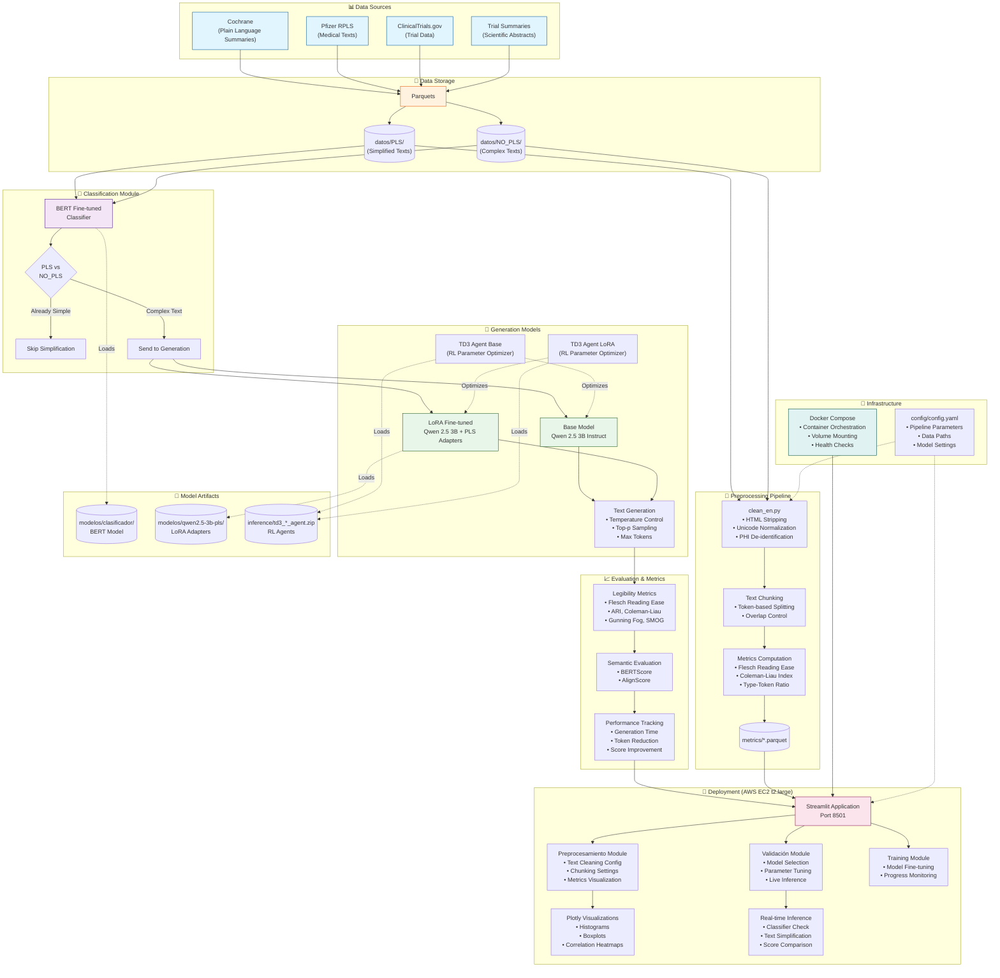

```mermaid
flowchart TD
    subgraph "📊 Data Sources"
        A1["Cochrane<br/>(Plain Language Summaries)"]
        A2["Pfizer RPLS<br/>(Medical Texts)"]
        A3["ClinicalTrials.gov<br/>(Trial Data)"]
        A4["Trial Summaries<br/>(Scientific Abstracts)"]
    end

    subgraph "💾 Data Storage"
        A1 --> S3["Parquets"]
        A2 --> S3
        A3 --> S3
        A4 --> S3
        S3 --> D1[("datos/PLS/<br/>(Simplified Texts)")]
        S3 --> D2[("datos/NO_PLS/<br/>(Complex Texts)")]
    end

    subgraph "🔧 Preprocessing Pipeline"
        D1 --> P1["clean_en.py<br/>• HTML Stripping<br/>• Unicode Normalization<br/>• PHI De-identification"]
        D2 --> P1
        P1 --> P2["Text Chunking<br/>• Token-based Splitting<br/>• Overlap Control"]
        P2 --> P3["Metrics Computation<br/>• Flesch Reading Ease<br/>• Coleman-Liau Index<br/>• Type-Token Ratio"]
        P3 --> M1[("metrics/*.parquet")]
    end

    subgraph "🤖 Classification Module"
        D1 --> C1["BERT Fine-tuned<br/>Classifier"]
        D2 --> C1
        C1 --> C2{"PLS vs<br/>NO_PLS"}
        C2 -->|Already Simple| C3["Skip Simplification"]
        C2 -->|Complex Text| C4["Send to Generation"]
    end

    subgraph "🧠 Generation Models"
        C4 --> G1["Base Model<br/>Qwen 2.5 3B Instruct"]
        C4 --> G2["LoRA Fine-tuned<br/>Qwen 2.5 3B + PLS Adapters"]
        
        TD3_1["TD3 Agent Base<br/>(RL Parameter Optimizer)"] -.->|Optimizes| G1
        TD3_2["TD3 Agent LoRA<br/>(RL Parameter Optimizer)"] -.->|Optimizes| G2
        
        G1 --> GEN["Text Generation<br/>• Temperature Control<br/>• Top-p Sampling<br/>• Max Tokens"]
        G2 --> GEN
    end

    subgraph "📈 Evaluation & Metrics"
        GEN --> E1["Legibility Metrics<br/>• Flesch Reading Ease<br/>• ARI, Coleman-Liau<br/>• Gunning Fog, SMOG"]
        E1 --> E2["Semantic Evaluation<br/>• BERTScore<br/>• AlignScore"]
        E2 --> E3["Performance Tracking<br/>• Generation Time<br/>• Token Reduction<br/>• Score Improvement"]
    end

    subgraph "🚀 Deployment (AWS EC2 t2.large)"
        E3 --> ST["Streamlit Application<br/>Port 8501"]
        M1 --> ST
        
        ST --> UI1["Preprocesamiento Module<br/>• Text Cleaning Config<br/>• Chunking Settings<br/>• Metrics Visualization"]
        ST --> UI2["Validación Module<br/>• Model Selection<br/>• Parameter Tuning<br/>• Live Inference"]
        ST --> UI3["Training Module<br/>• Model Fine-tuning<br/>• Progress Monitoring"]
        
        UI1 --> VIZ["Plotly Visualizations<br/>• Histograms<br/>• Boxplots<br/>• Correlation Heatmaps"]
        UI2 --> INF["Real-time Inference<br/>• Classifier Check<br/>• Text Simplification<br/>• Score Comparison"]
    end

    subgraph "🐳 Infrastructure"
        DOC["Docker Compose<br/>• Container Orchestration<br/>• Volume Mounting<br/>• Health Checks"]
        DOC --> ST
        CFG["config/config.yaml<br/>• Pipeline Parameters<br/>• Data Paths<br/>• Model Settings"]
        CFG -.-> P1
        CFG -.-> ST
    end

    subgraph "💾 Model Artifacts"
        MOD1[("modelos/clasificador/<br/>BERT Model")]
        MOD2[("modelos/qwen2.5-3b-pls/<br/>LoRA Adapters")]
        MOD3[("inference/td3_*_agent.zip<br/>RL Agents")]
        
        C1 -.->|Loads| MOD1
        G2 -.->|Loads| MOD2
        TD3_1 -.->|Loads| MOD3
        TD3_2 -.->|Loads| MOD3
    end

    style A1 fill:#e1f5ff,stroke:#01579b
    style A2 fill:#e1f5ff,stroke:#01579b
    style A3 fill:#e1f5ff,stroke:#01579b
    style A4 fill:#e1f5ff,stroke:#01579b
    style S3 fill:#fff3e0,stroke:#e65100
    style C1 fill:#f3e5f5,stroke:#4a148c
    style G1 fill:#e8f5e9,stroke:#1b5e20
    style G2 fill:#e8f5e9,stroke:#1b5e20
    style ST fill:#fce4ec,stroke:#880e4f
    style DOC fill:#e0f2f1,stroke:#004d40
```