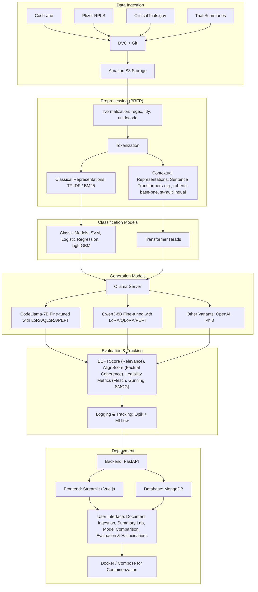

```mermaid
graph TD
    subgraph "Data Ingestion"
        A1[Cochrane] --> B[DVC + Git]
        A2[Pfizer RPLS] --> B
        A3[ClinicalTrials.gov] --> B
        A4[Trial Summaries] --> B
        B --> C[Amazon S3 Storage]
    end

    subgraph "Preprocessing (PREP)"
        C --> D[Normalization: regex, ftfy, unidecode]
        D --> E[Tokenization]
        E --> F1[Classical Representations: TF-IDF / BM25]
        E --> F2[Contextual Representations: Sentence Transformers e.g., roberta-base-bne, st-multilingual]
    end

    subgraph "Classification Models"
        F1 --> G1[Classic Models: SVM, Logistic Regression, LightGBM]
        F2 --> G2[Transformer Heads]
    end

    subgraph "Generation Models"
        G1 --> H[Ollama Server]
        G2 --> H
        H --> I1[CodeLlama-7B Fine-tuned with LoRA/QLoRA/PEFT]
        H --> I2[Qwen3-8B Fine-tuned with LoRA/QLoRA/PEFT]
        H --> I3[Other Variants: OpenAI, Phi3]
    end

    subgraph "Evaluation & Tracking"
        I1 --> J["BERTScore (Relevance), AlignScore (Factual Coherence), Legibility Metrics (Flesch, Gunning, SMOG)"]
        I2 --> J
        I3 --> J
        J --> K[Logging & Tracking: Opik + MLflow]
    end

    subgraph "Deployment"
        K --> L[Backend: FastAPI]
        L --> M[Frontend: Streamlit / Vue.js]
        L --> N[Database: MongoDB]
        M --> O[User Interface: Document Ingestion, Summary Lab, Model Comparison, Evaluation & Hallucinations]
        N --> O
        O --> P[Docker / Compose for Containerization]
    end
```